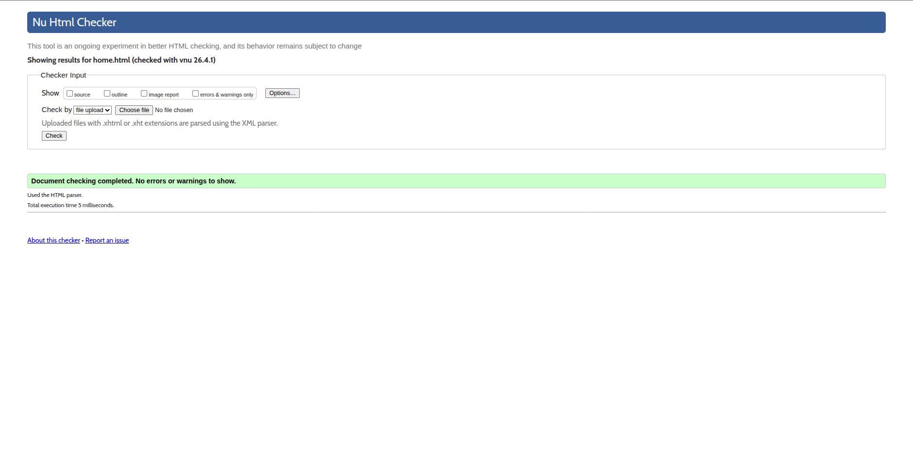
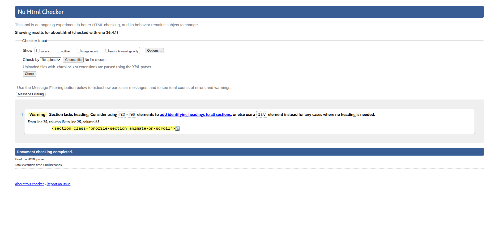
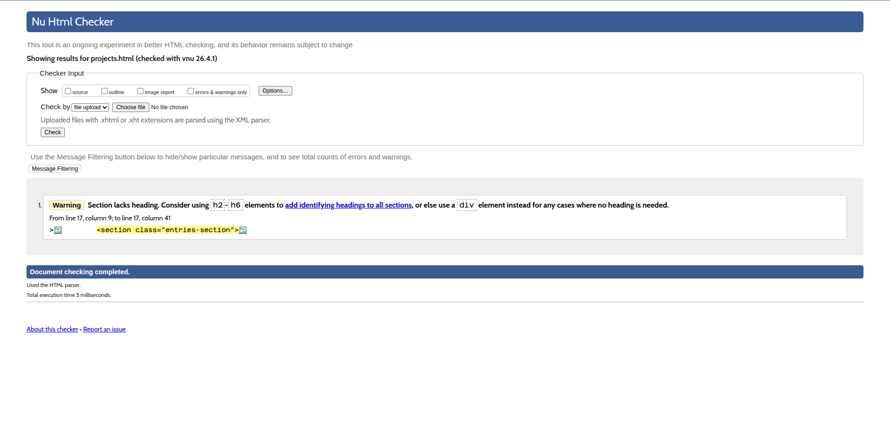
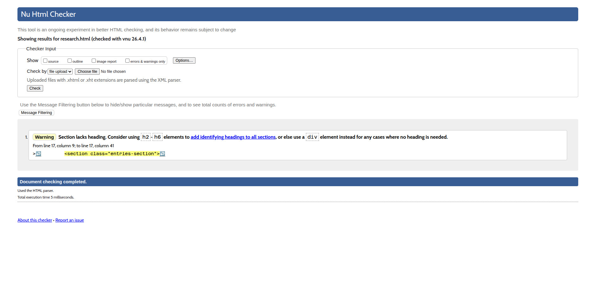
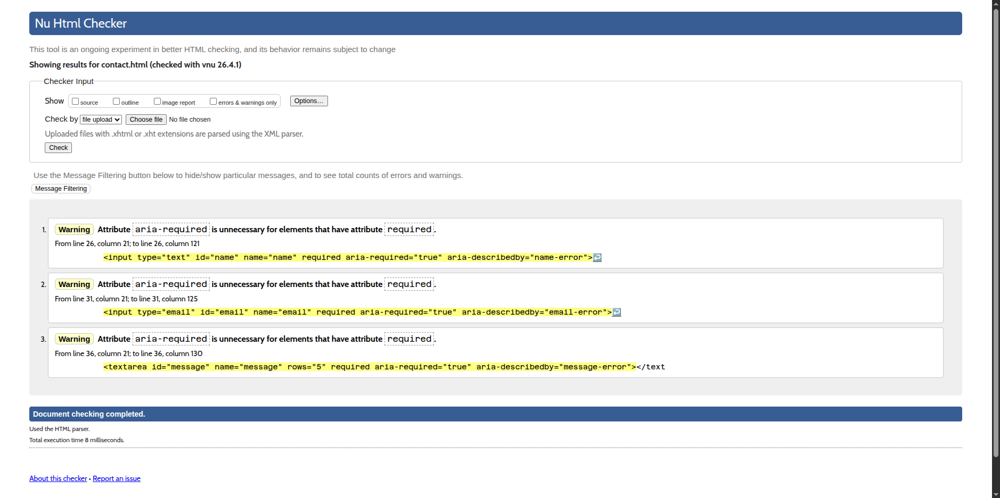
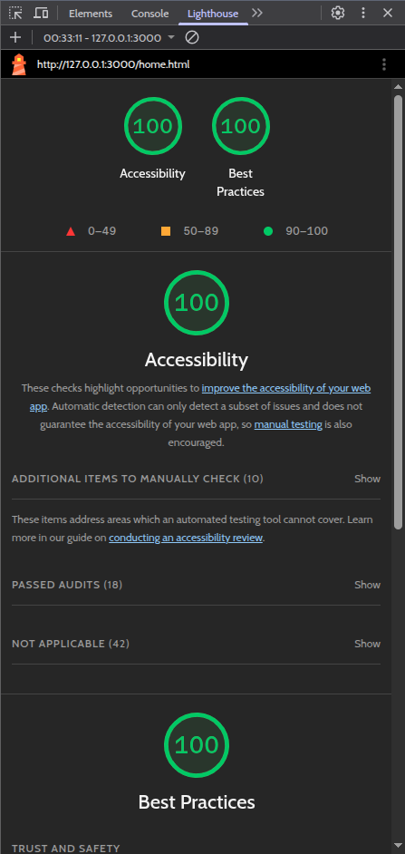
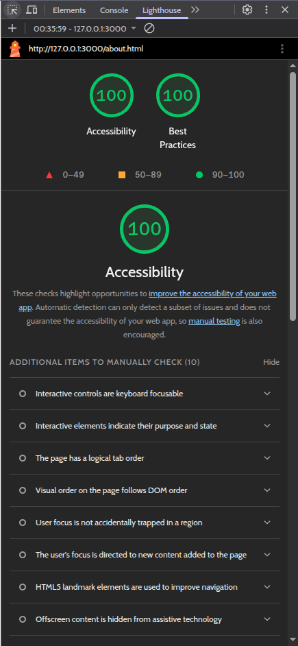
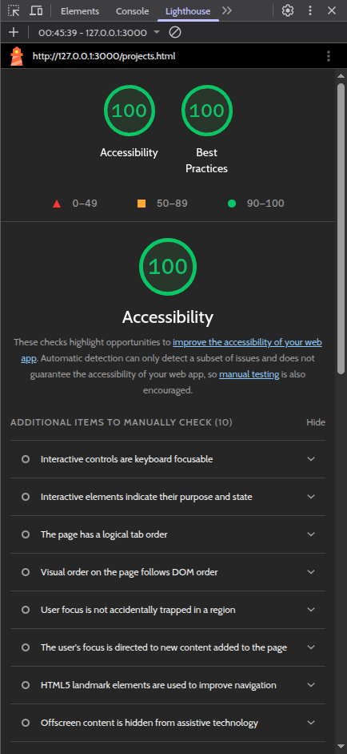
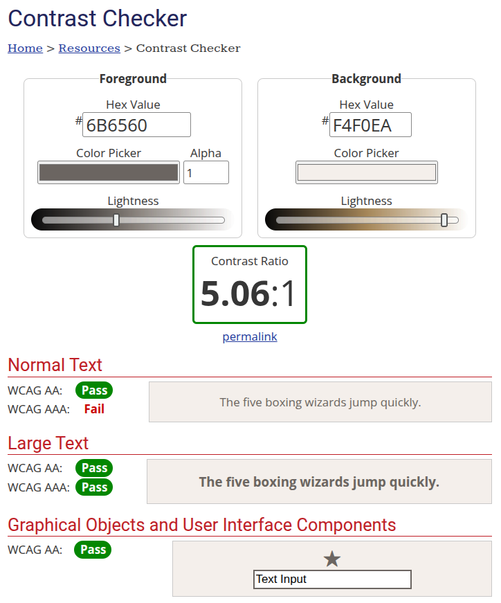
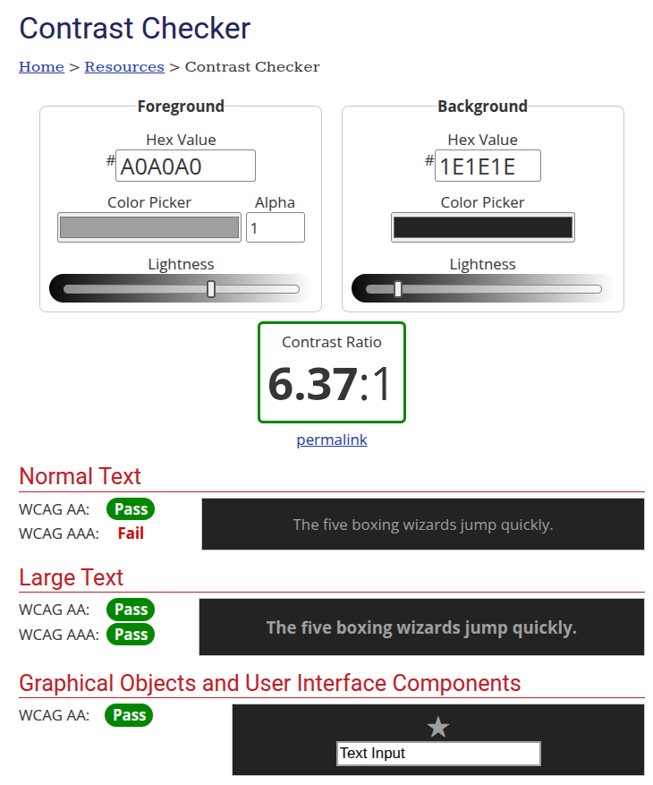

# Ashwin Hari — Roll No: 2025101022

## 1. JS Feature Choices (D4)

* **A2 — Session-Persistent Reading Progress**: I implemented an ES module that tracks the user's scroll depth on the About page. The current progress is stored in `sessionStorage`. Upon returning to the page within the same session, a styled prompt allows the user to jump back to their previous position.
* **B1 — Typed-Text Component**: I developed a reusable JavaScript class that handles a string-cycling state machine. I also implemented additional 'override' functionality for my usecase. It manages typing, pausing, and erasing with configurable speeds, while the blinking cursor is handled via CSS animations for performance.

## 2. Typographic Pairing (D2)

* **Pairing:** **IBM Plex Mono** (Headings) and **Inter** (Body).
* **Justification:** I wanted to choose Heading and Body fonts that are distinct and serve different purposes. This is why I chose a monospaced title font, IBM Plex Mono and a sans-serif body font, Inter. These are both highly legible fonts which contrast each other.

## 3. Animation Justifications (D3)

* **Hero Entrance Sequence:** The desk enters, followed by the items on it (Laptop, Photos, ID Card) which use staggered `animation-delay`. This makes the items appear as if they are being placed on the desk, and guides the user's eye to the interactive navigation elements.
* **Scroll-Triggered Sections:** On the About page, each event on the timelines fades in and slides upward using the Intersection Observer API. This communicates a sense of progression as the user reads through my history.
* **Micro-interactions:** The desk items use a `cubic-bezier(0.34, 1.56, 0.64, 1)` hover transition. This "spring" easing communicates a tactile, physical response when the user interacts with the desk objects.

## 4. Screenshots & Compliance

* **W3C HTML Validator:**

* **Lighthouse Audit:**  

* **WCAG Contrast Check (Light):**  

* **WCAG Contrast Check (Dark):**

## 5. Deployment

* **Live URL:** `https://web.iiit.ac.in/~ashwin.hari/`
